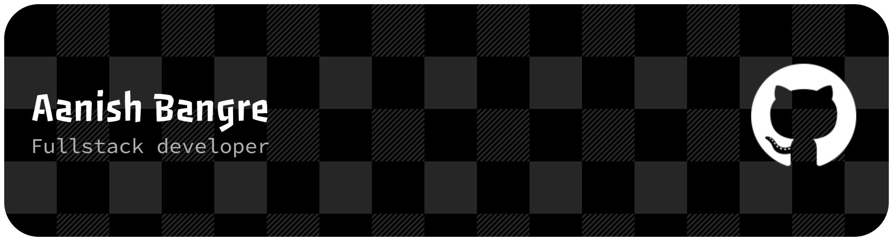

<h1 align="center">
  
</h1>

<!--  -->

## 🌌 Tech Universe

A visual constellation of everything I work with — 

## 🧠 Core Languages

## 🎨 Frontend Engineering

**Frameworks / Libraries**  

**Markup / Styling**  

## 🏗️ Backend & API Crafting

## 🧵 Databases & Storage Layer

## 🧪 Testing, AI & Scientific Stack

**Testing**  

**AI / ML / Data**  

## 📦 Tools, Runtimes & Developer Workflow

**Package / Build Tools**  

**Runtime / Infrastructure Tools**  

**Editors / Workspace**  

## 📱 Cross-Platform & UI Development

## ☁️ Cloud & Deployment
